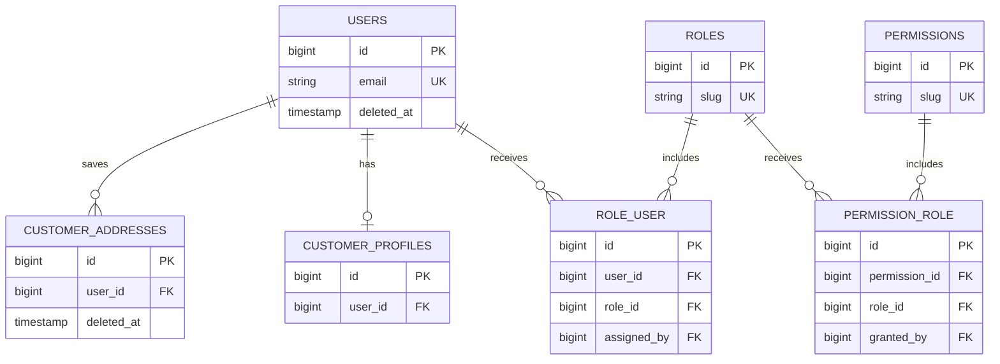
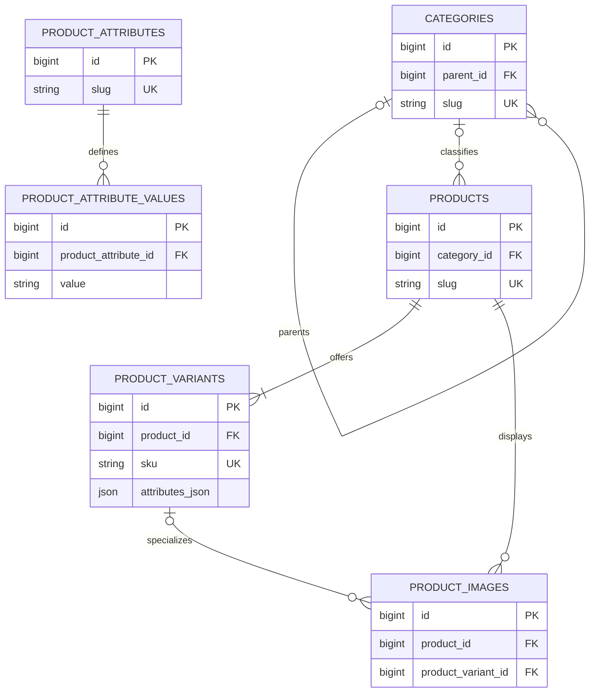
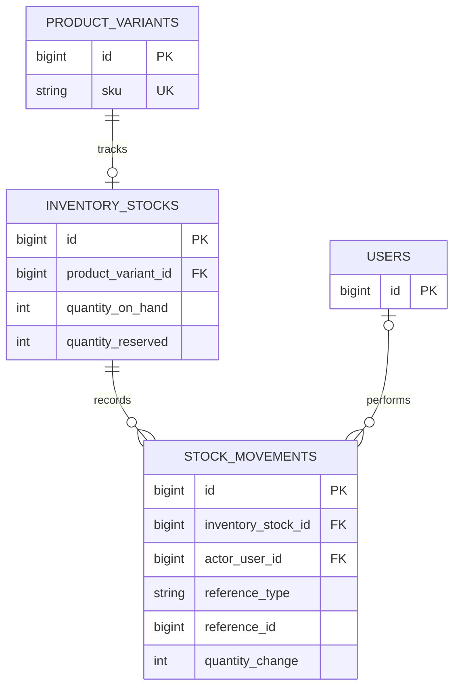
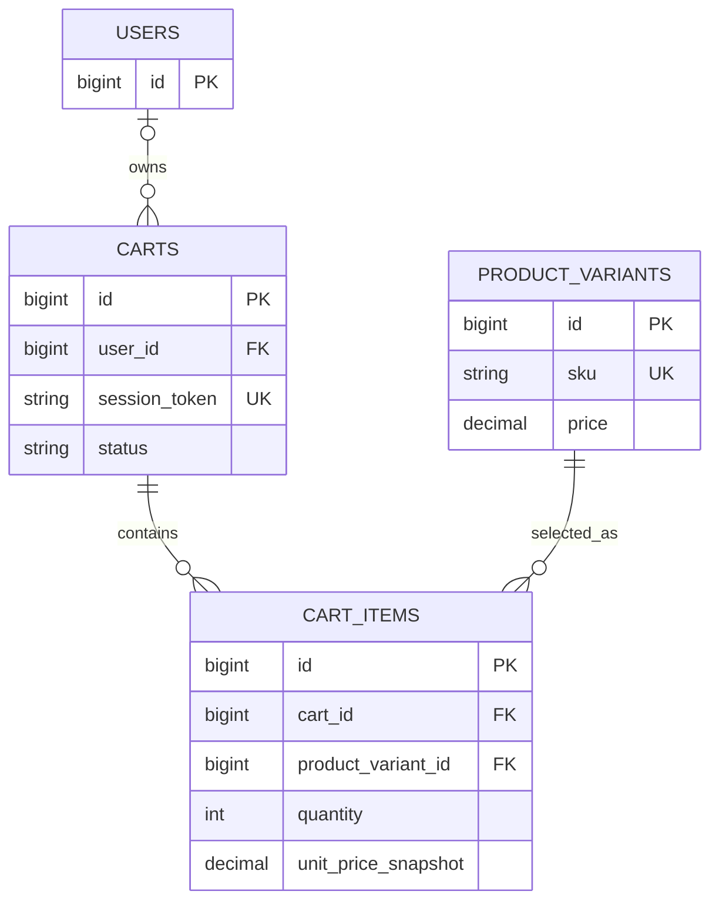
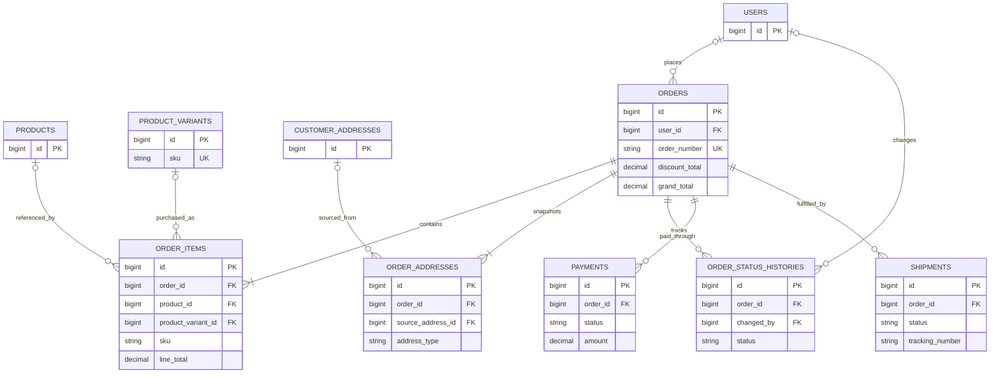
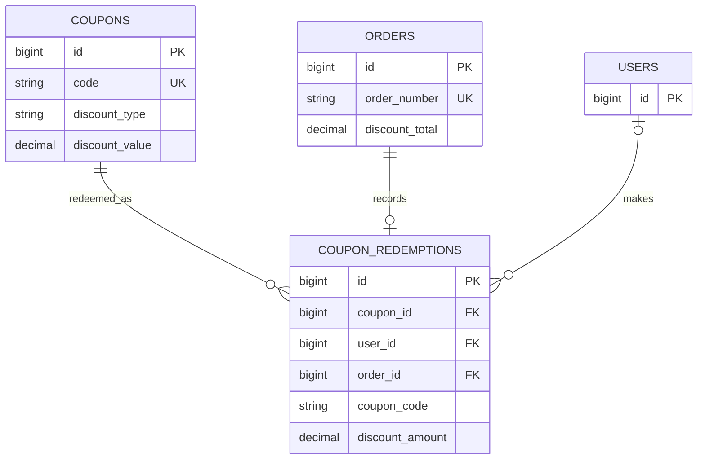
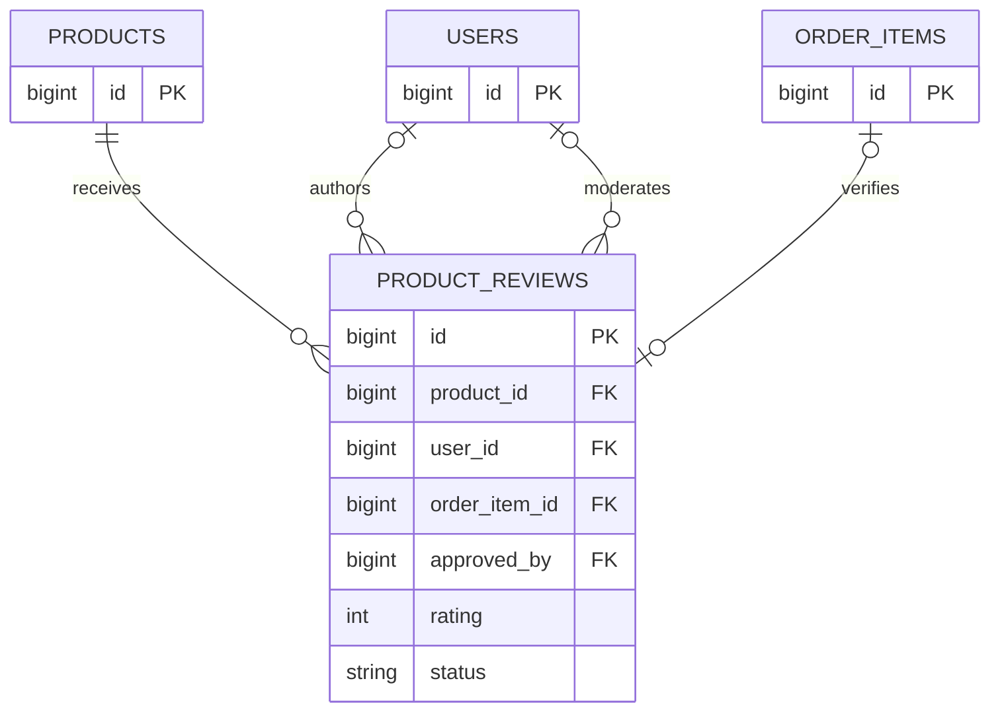
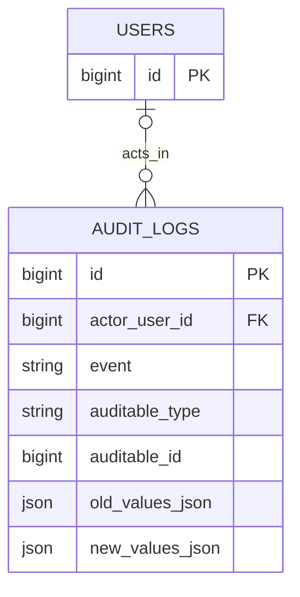

# E-Commerce Platform ERD

## Purpose

This document presents the approved relational structure for the E-Commerce Platform - Laravel React project. The main diagram provides complete coverage of all 27 business tables, while the module diagrams isolate smaller relationship groups for implementation planning and portfolio review.

## ERD Conventions

The diagrams use Mermaid `erDiagram` syntax. Entity names map directly to approved `snake_case` table names, displayed in uppercase for readability.

- `||--||` represents a required one-to-one relationship.
- `||--o|` represents a required parent with zero or one related record.
- `||--o{` represents one-to-many where the child collection can be empty.
- `||--|{` represents one-to-many where at least one child is required by the approved business rule.
- `o|` on a relationship end indicates an optional reference.
- Many-to-many relationships are resolved through approved pivot tables such as `role_user` and `permission_role`.
- Polymorphic-style references cannot use a conventional foreign key to several possible tables. They are shown as attributes and explained in prose instead of drawing unsupported relationships.
- Diagram attributes emphasize primary keys, foreign keys, unique business keys, and snapshot or polymorphic fields. The complete column blueprint remains in [Schema Blueprint](schema-blueprint.md).

## Main ERD

```mermaid
erDiagram
    USERS {
        bigint id PK
        string email UK
        string status
        timestamp deleted_at
    }
    ROLES {
        bigint id PK
        string slug UK
    }
    PERMISSIONS {
        bigint id PK
        string slug UK
    }
    ROLE_USER {
        bigint id PK
        bigint user_id FK
        bigint role_id FK
        bigint assigned_by FK
    }
    PERMISSION_ROLE {
        bigint id PK
        bigint permission_id FK
        bigint role_id FK
        bigint granted_by FK
    }
    CUSTOMER_PROFILES {
        bigint id PK
        bigint user_id FK
    }
    CUSTOMER_ADDRESSES {
        bigint id PK
        bigint user_id FK
        boolean is_default
        timestamp deleted_at
    }
    CATEGORIES {
        bigint id PK
        bigint parent_id FK
        string slug UK
        timestamp deleted_at
    }
    PRODUCTS {
        bigint id PK
        bigint category_id FK
        string slug UK
        decimal base_price
        timestamp deleted_at
    }
    PRODUCT_IMAGES {
        bigint id PK
        bigint product_id FK
        bigint product_variant_id FK
        string path
    }
    PRODUCT_ATTRIBUTES {
        bigint id PK
        string slug UK
    }
    PRODUCT_ATTRIBUTE_VALUES {
        bigint id PK
        bigint product_attribute_id FK
        string value
    }
    PRODUCT_VARIANTS {
        bigint id PK
        bigint product_id FK
        string sku UK
        json attributes_json
        decimal price
        timestamp deleted_at
    }
    INVENTORY_STOCKS {
        bigint id PK
        bigint product_variant_id FK
        int quantity_on_hand
        int quantity_reserved
    }
    STOCK_MOVEMENTS {
        bigint id PK
        bigint inventory_stock_id FK
        bigint actor_user_id FK
        string reference_type
        bigint reference_id
        int quantity_change
    }
    CARTS {
        bigint id PK
        bigint user_id FK
        string session_token UK
        string status
    }
    CART_ITEMS {
        bigint id PK
        bigint cart_id FK
        bigint product_variant_id FK
        int quantity
        decimal unit_price_snapshot
    }
    ORDERS {
        bigint id PK
        bigint user_id FK
        string order_number UK
        string status
        decimal discount_total
        decimal grand_total
    }
    ORDER_ITEMS {
        bigint id PK
        bigint order_id FK
        bigint product_id FK
        bigint product_variant_id FK
        string sku
        json attributes_json
        decimal line_total
    }
    ORDER_ADDRESSES {
        bigint id PK
        bigint order_id FK
        bigint source_address_id FK
        string address_type
        string recipient_name
    }
    ORDER_STATUS_HISTORIES {
        bigint id PK
        bigint order_id FK
        bigint changed_by FK
        string status
    }
    PAYMENTS {
        bigint id PK
        bigint order_id FK
        string provider_reference UK
        string status
        decimal amount
    }
    SHIPMENTS {
        bigint id PK
        bigint order_id FK
        string tracking_number
        string status
    }
    COUPONS {
        bigint id PK
        string code UK
        string discount_type
        decimal discount_value
        timestamp deleted_at
    }
    COUPON_REDEMPTIONS {
        bigint id PK
        bigint coupon_id FK
        bigint user_id FK
        bigint order_id FK
        decimal discount_amount
    }
    PRODUCT_REVIEWS {
        bigint id PK
        bigint product_id FK
        bigint user_id FK
        bigint order_item_id FK
        bigint approved_by FK
        int rating
        timestamp deleted_at
    }
    AUDIT_LOGS {
        bigint id PK
        bigint actor_user_id FK
        string event
        string auditable_type
        bigint auditable_id
    }

    USERS ||--o{ ROLE_USER : receives
    ROLES ||--o{ ROLE_USER : assigns
    ROLES ||--o{ PERMISSION_ROLE : contains
    PERMISSIONS ||--o{ PERMISSION_ROLE : grants
    USERS o|--o{ ROLE_USER : assigned_by
    USERS o|--o{ PERMISSION_ROLE : granted_by

    USERS ||--o| CUSTOMER_PROFILES : has
    USERS ||--o{ CUSTOMER_ADDRESSES : saves

    CATEGORIES o|--o{ CATEGORIES : parents
    CATEGORIES o|--o{ PRODUCTS : classifies
    PRODUCTS ||--o{ PRODUCT_IMAGES : displays
    PRODUCTS ||--|{ PRODUCT_VARIANTS : offers
    PRODUCT_VARIANTS o|--o{ PRODUCT_IMAGES : specializes
    PRODUCT_ATTRIBUTES ||--o{ PRODUCT_ATTRIBUTE_VALUES : defines

    PRODUCT_VARIANTS ||--o| INVENTORY_STOCKS : tracks
    INVENTORY_STOCKS ||--o{ STOCK_MOVEMENTS : records
    USERS o|--o{ STOCK_MOVEMENTS : performs

    USERS o|--o{ CARTS : owns
    CARTS ||--o{ CART_ITEMS : contains
    PRODUCT_VARIANTS ||--o{ CART_ITEMS : selected_as

    USERS o|--o{ ORDERS : places
    ORDERS ||--|{ ORDER_ITEMS : contains
    ORDERS ||--|{ ORDER_ADDRESSES : snapshots
    ORDERS ||--o{ ORDER_STATUS_HISTORIES : tracks
    PRODUCTS o|--o{ ORDER_ITEMS : referenced_by
    PRODUCT_VARIANTS o|--o{ ORDER_ITEMS : purchased_as
    CUSTOMER_ADDRESSES o|--o{ ORDER_ADDRESSES : sourced_from
    USERS o|--o{ ORDER_STATUS_HISTORIES : changes
    ORDERS ||--o{ PAYMENTS : paid_through
    ORDERS ||--o{ SHIPMENTS : fulfilled_by

    COUPONS ||--o{ COUPON_REDEMPTIONS : redeemed_as
    ORDERS ||--o| COUPON_REDEMPTIONS : records
    USERS o|--o{ COUPON_REDEMPTIONS : makes

    PRODUCTS ||--o{ PRODUCT_REVIEWS : receives
    USERS o|--o{ PRODUCT_REVIEWS : authors
    USERS o|--o{ PRODUCT_REVIEWS : moderates
    ORDER_ITEMS o|--o| PRODUCT_REVIEWS : verifies

    USERS o|--o{ AUDIT_LOGS : acts_in
```

The main ERD includes every approved business table. Optional catalog references on historical rows can be cleared without losing snapshots. Polymorphic-style audit subjects and stock source documents are intentionally not connected to invented entities.

## Authentication, RBAC, and Customer Profile

`role_user` resolves the user-to-role many-to-many relationship, and `permission_role` resolves the role-to-permission relationship. Their unique key pairs prevent duplicate assignments. `customer_profiles.user_id` is unique, producing a one-to-zero-or-one profile relationship, while one user can retain multiple saved addresses.

## Catalog, Categories, Products, Variants, Images, and Attributes

`products` are catalog parents; `product_variants` are the sellable SKUs. Every product has at least one variant, so a simple product receives one default variant. `product_variants.attributes_json` stores the selected attribute values for that SKU. The approved design deliberately has no variant-value pivot table, and none should be introduced without a separate design revision.

## Inventory Stocks and Stock Movements

Current stock belongs to the sellable variant through `inventory_stocks`; no stock is stored on `products`. `stock_movements` is the append-oriented ledger for that stock row. It may identify a source document through the approved `reference_type` and `reference_id` polymorphic-style pair. In business terms these are the source type and source ID; this ERD does not introduce separate `source_type` or `source_id` columns that are absent from the schema blueprint.

## Cart and Checkout Preparation

A cart can belong to a user or use a guest session token. Every cart item targets a sellable product variant, including the default variant of a simple product. The cart price is a temporary snapshot; future checkout logic must revalidate variant status, price, and inventory before creating an order.

## Orders, Addresses, Status, Payments, and Shipments

`order_items` preserve SKU, product, variant, selected attributes, price, discount, tax, and line-total snapshots. `order_addresses` preserve billing and shipping snapshots independently of later saved-address edits. Product, variant, saved-address, customer, and actor references can be optional for retention purposes, while the snapshots remain authoritative.

## Coupons and Coupon Redemptions

`coupon_redemptions` is the authoritative coupon-to-order link. Unique `coupon_redemptions.order_id` limits an order to at most one coupon redemption. The order keeps `discount_total`, while the redemption keeps the coupon code and applied discount snapshots; `orders` has no direct coupon foreign key.

## Product Reviews

A review belongs to a product and can retain optional author, approving-user, and order-item references. Unique non-null `order_item_id` supports at most one review per purchased line. Verified-purchase status must later be derived from matching user, product, and order-item evidence rather than trusted from client input.

## Audit Logs

`audit_logs.actor_user_id` optionally identifies the responsible user. `auditable_type` and `auditable_id` form the polymorphic-style subject reference for approved auditable records. Because one pair can identify several table types, no conventional subject foreign key or artificial relationship is drawn. Audit payloads must later exclude secrets and sensitive payment data.

## Important Design Decisions

- Products are catalog parents; product variants are the purchasable SKUs.
- Every product has at least one variant, including one default variant for a simple product.
- Current stock belongs to a variant through `inventory_stocks`, and stock history belongs to that stock row through `stock_movements`.
- `product_variants.attributes_json` stores selected attribute values. No unapproved variant-value pivot table is part of the design.
- Cart items and new order items target product variants rather than products as sellable units.
- `order_items` and `order_addresses` preserve checkout snapshots so historical orders do not depend on mutable catalog or customer-address data.
- `coupon_redemptions` is the authoritative coupon-to-order link, with unique `order_id` allowing at most one redemption per order.
- `audit_logs.auditable_type` and `auditable_id` form a polymorphic-style reference.
- Stock movements can identify source documents with the approved `reference_type` and `reference_id` pair, conceptually the source type and source ID.

## Implementation Notes

This ERD is a design reference for later authorized scopes:

- Future Laravel migrations should follow the dependency order, keys, nullability, uniqueness, retention rules, and delete behavior documented across the database design set.
- Future Eloquent models can map one-to-one, one-to-many, many-to-many, and polymorphic-style relationships from these diagrams without introducing new tables.
- Future API Resources can expose stable identifiers and snapshots while keeping internal actor, audit, payment-provider, and retention details appropriately scoped.
- Future admin features can use RBAC, catalog, inventory, order, payment, shipment, coupon, review, and audit relationships for operational workflows.
- Future storefront features can resolve catalog products to sellable variants and preserve the documented cart and checkout boundaries.

These notes describe how the ERD can guide later work; they do not claim that any migration, model relationship, API resource, or feature has been implemented.

## Scope Boundary

This document is ERD documentation only. It does not implement migrations, authentication, product CRUD, cart, checkout, orders, coupons, reviews, reports, or any backend or frontend feature.
