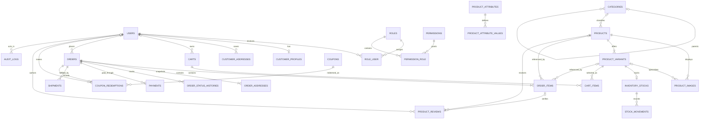

# High-Level Entity Relationship Diagram

The diagram focuses on primary ownership and major operational relationships. It intentionally omits most columns so the module boundaries remain readable.

`role_user` and `permission_role` resolve the custom RBAC many-to-many relationships. Products are catalog parents, while product variants are the sellable SKUs; even a simple product has one default variant. Product variants use `attributes_json` for selected values, so the blueprint does not introduce an unapproved variant-value pivot table. `coupon_redemptions` is the authoritative coupon-to-order link and limits an order to at most one redemption. Order items and addresses preserve checkout snapshots even when optional source references later change. `audit_logs.auditable_type` and `audit_logs.auditable_id`, plus the equivalent stock movement reference pair, are polymorphic-style references and therefore are explained in prose rather than drawn as conventional foreign keys.
